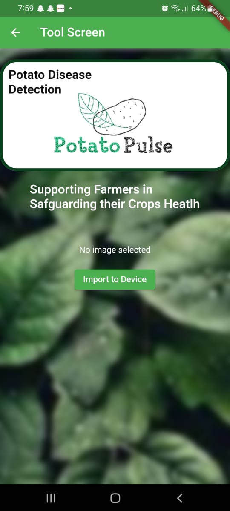
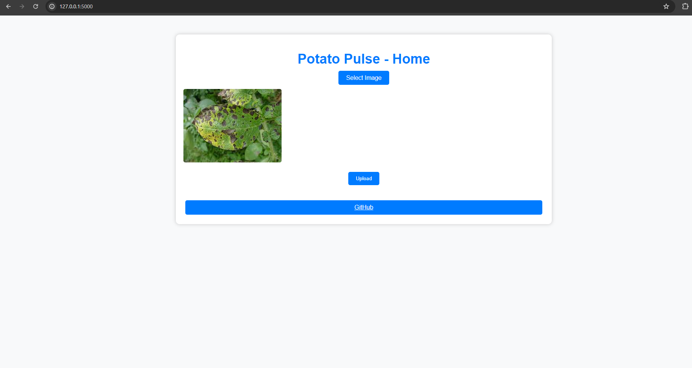
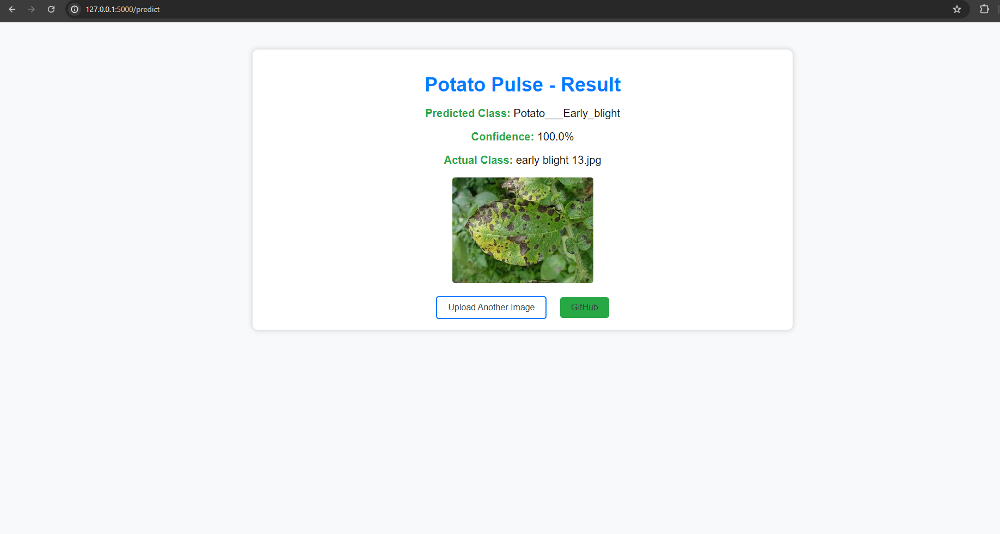

# POTATO DISEASE DETECTION 


In the agricultural sector, potato crops play a crucial role in global food security and economy. However, potato blight, encompassing both early and late blight diseases, poses a significant threat to potato yield and quality. Early detection and accurate classification of these diseases are paramount in mitigating losses and implementing effective management strategies. "Potato Pulses" aims to address this challenge by leveraging artificial intelligence to analyze potato leaf images, thereby enabling the identification of healthy leaves and the differentiation between early and late blight diseases. This project not only contributes to safeguarding potato crops but also supports farmers in taking timely actions to protect their yield.

### **Importance of the Project**
The importance of this project stems from its potential to transform the traditional approach to disease management in potato farming. By providing a quick and accurate diagnosis tool, the project facilitates early intervention, which is critical for controlling the spread of blight diseases. Additionally, this AI-based solution offers a scalable and cost-effective alternative to labor-intensive and subjective traditional methods, ultimately enhancing productivity and sustainability in potato farming.

### **Dataset**
The dataset consists of high-quality images of potato leaves, categorized into three groups: healthy, early blight, and late blight. Each image is labeled according to its disease state, serving as the foundation for training and evaluating the AI model.
for more info goto [Dataset-info](Data Training/Documentation.txt)

### **Preprocessing Steps**
**Image Cleaning:** Removal of irrelevant content from images, such as background noise and unrelated objects, to focus on the leaf itself.

**Normalization**: Standardization of image dimensions and color intensities to ensure uniformity across the dataset, enhancing the model's ability to learn from the data.

**Augmentation:** Application of various transformations like rotation, flipping, and scaling to increase the dataset's diversity. This step helps improve the model's robustness and ability to generalize from the training data to real-world scenarios.

**Splitting:** Division of the dataset into training, validation, and test sets. This separation is critical for training the model, tuning its parameters, and evaluating its performance accurately.

By clearly defining the problem, emphasizing the project's significance, and outlining a meticulous approach to data preparation, "Potato Pulses" is positioned as a crucial innovation in combating potato blight diseases through the application of AI.

### ***Setup for Python:***

1. Install Python [Setup Guide](https://wiki.python.org/moin/BeginnersGuide)

2. Install Python packages

3. To install dependencies for training, run:

```
pip3 install -r training/requirements.txt
```
4. To install dependencies for the API, run:
```
pip3 install -r api/requirements.txt
```
5. Install Tensorflow Service [Setup Guide](https://www.tensorflow.org/tfx/serving/setup)


### ***Setup for Vanilla JavaScript with Flask Backend:*** 


1. Install Dependencies:

-Make sure you have Python and pip installed for Flask.
-To install Flask and other dependencies for your Flask backend, you can use pip:
```
pip install flask
```
2. Copy `.env.example` as `.env`:

3. Change API URL in `.env`:

### ***Setup for Flutter app:***
1. Install Flutter SDK:

2. Install Flutter dependencies
  - Once Flutter is installed, ensure that you have all necessary dependencies for Flutter development by running:
   ```
   flutter doctor
   ```
  - Install any missing dependencies according to the instructions provided by `flutter doctor`.
3. Clone the repository:
   
4. Navigate to the project directory:
   ```
   cd mobile-app
   ```
5. Install dependencies:
   ```
   flutter pub get
   ```
6. Copy `.env.example` as `.env`.

7. Change API url in `.env`.

### ***Training the Model:***
1. Download the data from [kaggle](https://www.kaggle.com/datasets/arjuntejaswi/plant-village).
2. Only keep folders related to Potatoes.
3. Run Jupyter Notebook in Browser.
`jupyter notebook`
4. Open `training/potato-disease-training.ipynb` in Jupyter Notebook.
5. In cell #2, update the path to dataset.
6. Run all the Cells one by one.
7. Copy the model generated and save it with the version number in the `models` folder.


### ***Creating the TF Model:***
1. Run Jupyter Notebook in Browser.
```
jupyter notebook
```
2. Open `training/tf-lite-converter.ipynb` in Jupyter Notebook.
3. In cell #2, update the path to dataset.
4. Run all the Cells one by one.
5. Model would be saved in `tf-lite-models` folder.


### ***Mobile-Application ScreenShot***



### *WEB Page*


### ***Result***

